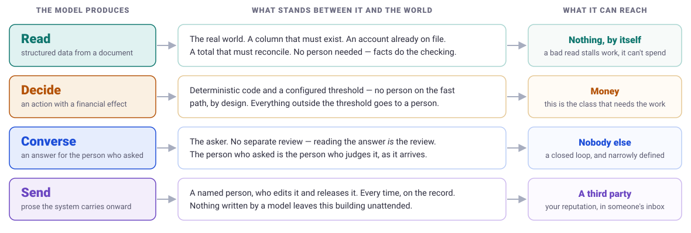

# heldby

**Find every place AI runs in your codebase, and name what stands between each model's output and a real-world effect.**

Output is an *AI register*: a table you can hand to an auditor, paste into a vendor
questionnaire, or publish as a trust-centre page.

The four-class framework below was developed at [receipting.ai](https://receipting.ai) to
govern its own estate. The tool is MIT-licensed; so is the framework. Use both.

## Install

As a Claude Code plugin — this is the way you want it, because classification needs a
model reading your code:

```
/plugin marketplace add receipting/heldby
/plugin install heldby@heldby
```

Or use the deterministic half on its own, with no install:

```bash
uvx heldby scan .          # find every place a model might run
uvx heldby catalog         # print the entire detection surface
```

---

## The two useless questions

Every AI governance conversation currently runs on two of them:

- *"Do you use AI?"* — everyone does.
- *"How accurate is the model?"* — unanswerable, and the wrong axis.

The useful question is **what the model can reach when it is wrong** — because it will be
wrong, at a rate nobody can drive to zero.

Almost nobody can answer that about their own codebase, because almost nobody has an
inventory. `heldby` builds the inventory and classifies it.

<p align="center">
  
</p>

## The four classes

| Class | What the model does | The rule |
|---|---|---|
| **Read** | Turns a document or message into structured data | No person required — but the output must be checkable against something real: a column that exists in the file, an account already on file, a total that reconciles. If it cannot be checked against the world, it is not Read. |
| **Decide** | Proposes an action with a consequential real-world effect | No person on the fast path *by design*. Bounded by deterministic gates plus a configured threshold; everything outside the threshold goes to a queue a person works. |
| **Converse** | Answers the person who asked — them and you, nobody else | No separate review, because the person who asked is the person who judges the answer, as they read it. Only valid if the loop is genuinely closed. |
| **Write** | Produces prose the system will carry to someone else | A named person edits and releases it, and the record says who. Nothing AI-written leaves unattended. |

Where a process spans two classes, **the stricter class governs**. Strictness order:
Read < Converse < Decide < Write.

### Why four and not two

Input/output is the obvious split and it breaks on the first hard case. A payment-matching
engine reads nothing a person will see and writes nothing a person will read — **and it
moves money**. File it under input and you have classified your only money-moving process
as low risk. File it under output and you have committed to a human reviewing every
allocation, which is the entire job the software exists to remove.

The classes are defined by **the gate, not the technology**. Two call sites using the same
model on the same document belong to different classes if what they can reach differs.

### The closed-loop test (Converse only)

Converse is the class people will abuse, because "it's just a chatbot, the user reads it"
is the easiest way to dodge review. All three must hold:

1. **A person started it** — not a cron, not a queue, not another system.
2. **It reaches only the asker and the operator.** Both parties to the conversation may
   hold it. What breaks the loop is a **third** party the asker did not address.
3. **It does nothing.** No payment, no send, no write to a system of record, no row another
   process later acts on.

The line between Converse and Write is **who carries the output onward**. If a person
carries it, they reviewed it by definition — reading it *is* the review. If the system
carries it, stores it to serve later, or routes it to a third party, that is Write.

Fail any one test and it is Write. A class you can file into to dodge review is worse than
no class at all.

## "Held by" — the load-bearing column

For every AI use, name the specific control between the model's output and the effect. Not
"we have guardrails". The register entry has to survive an auditor reading the code next to
it. Real examples:

- *Sign alignment blocks a debit matching a credit; totals are recomputed from the invoice
  rows rather than read from the model; only a high-confidence match inside the configured
  threshold auto-allocates, and everything else goes to a human queue.*
- *Every column it names must exist in the file; the mapping is cached per header layout
  and reused rather than re-guessed.*
- *Ranks a closed list harvested deterministically by code — never proposes an address
  itself. Any address it returns that was not harvested is discarded.*
- *Three outcomes only, and every failure path defaults to the one that escalates.*

If the honest answer is **"nothing"**, the register says nothing. **A register that cannot
record a gap is a brochure.**

## What it is not

Said out loud, because tools in this space routinely imply otherwise:

- **Not taint analysis**, and it must never imply it is. Reachability is a reported claim
  with a confidence and a tier, never a proof.
- **Not a model-accuracy evaluator.** Accuracy is the wrong axis; see above.
- **Not a prompt-injection scanner** — though it flags where untrusted input reaches a
  prompt, because that is reach.
- **Not a compliance certification, and not legal advice.**

Every finding carries a confidence — confirmed, inferred or unknown — and the report states
in plain words what the analysis could not see. If a sweep skips a language or caps at N
files, it says so: silent caps read as "covered everything".

## The commands

The split is the architecture. Discovery, linting and emission are **deterministic** and
gate a build with an exit code. Classification — what class a site is, and what actually
holds it — needs a model reading the surrounding code, so it lives in the skill and its
result is committed as a reviewed artefact. CI checks the artefact is current; it never
re-infers it.

| Command | What it does | Model? |
|---|---|---|
| `heldby scan <repo>` | Every candidate model call site, every protected action near it, and what it could not see | no |
| *(the skill)* | Reads the code around each site and assigns class, reach and `held_by` | **yes** |
| `heldby register` | Renders the register a customer or auditor reads, plus a completeness check | no |
| `heldby lint <repo>` | Fails the build on a model call outside the designated gateway module | no |
| `heldby adopt <repo>` | Writes declarations and the gate into the repo, so the next run is declared not guessed | no |
| `heldby catalog` | Prints the detection surface; `--check-registries` resolves every package name | no |

### Discovery is tuned for recall, not precision

It emits candidates marked `confirmed` or `inferred` and expects the classify pass to
clear the false positives. An over-flagged site costs a reviewer a minute; a
wrongly-cleared site hides exactly the risk this exists to find, behind a clean report.

Two failure modes it will hit on real code, and reports rather than hides:

- **The factory.** Provider SDKs confined to a few client-construction files while the
  actual AI features live in modules importing no SDK at all. Both are reported and
  neither is linked — so trust the self-labelled process names over the call sites.
- **The provider registry.** A dozen vendors behind one `openai` import, separated only
  by `base_url` values in a config table. The base URL is the only tell, and the model
  id is usually a runtime value — so "which model" is often legitimately unanswerable.

### Graduating off inference

`heldby adopt` writes the findings back as declarations plus a lint gate, so a new AI
call cannot ship without declaring what it is — it will not compile. It **ratchets**:
one gateway module is designated and every existing bypass is baselined, so the gate is
green on day one and can only tighten. And it generates the *typed wrapper*, not just
the declaration, because the load-bearing part is the `feature: AIFeature` parameter
rather than the list.

## The catalogue

Detection is driven by data, not by prose baked into a prompt, so it can be extended by
pull request without touching any logic.

```bash
uvx heldby catalog                     # print the entire detection surface
uvx heldby catalog --check-registries  # resolve every package name against npm and PyPI
```

Two design rules make the catalogue trustworthy:

**Imports and registries are different things.** `imports` is what appears in an import
statement; `registry` is what a package index knows the distribution as. They genuinely
differ — the Google SDK is `@google/genai` on npm, `google-genai` on PyPI, and
`google.genai` in a Python import. A catalogue that conflates them reports "no AI detected"
over a Python codebase built on LangChain.

**The catalogue only grows.** A rule is never deleted and its match is never narrowed; a
superseded package is marked `deprecated: true` and keeps matching, because repos on the old
SDK still exist and a deleted rule is a silent blind spot. Renames are therefore additive —
which is what makes the nightly freshness job safe to merge unattended.

Adding a rule: see [`src/heldby/catalog/`](src/heldby/catalog/). Contributions of new
frameworks and providers are the most useful thing you can send.

---

## Who built this, and why

`heldby` comes out of [receipting.ai](https://receipting.ai), which reconciles insurance
premium-trust-account payments — bank statements and remittances arrive by email, and the
platform matches them to invoices and posts the results into each customer's accounting
system. About twenty AI processes across six repositories, several of which touch money.

The framework exists because we had to answer the question for real, in front of an
auditor, with a contractual obligation to notify a customer before adding any new AI
service. Three attempts got us here:

1. **A grep sweep.** Missed an entire repository.
2. **A call-graph reach analyser.** It graded a well-known agent that shells out to the
   host as safe, because the agent called its model through an interface and the call graph
   severed there — and the tool's own honesty instrumentation reported zero uncertainty at
   exactly the point it had gone blind. It also had no Python support, which is why a
   script calling a provider directly, outside the gateway everything was supposed to route
   through, went unnoticed for months.
3. **Declaring it in the code**, with a lint gate that fails the build when an AI call
   ships without a declaration. That is what we run now.

The expensive lesson: **for code you control, declaring and enforcing beats inferring.**
Inference is the right tool for a repo you do not control and cannot mandate anything about
— which is exactly the position you are in when you first point this at a codebase. So
`heldby` infers first, then offers to write the findings back as declarations plus a gate,
so the next run is *declared* rather than guessed.

The other lesson, from the register itself: a live incident auto-allocated four wrong
invoices because the code trusted a total the model had added up. Totals are now recomputed
from the invoice rows. That one sentence is what a "held by" column is for, and no
accuracy score would ever have surfaced it.

MIT licensed. Copyright © 2026 Managed Functions Pty Ltd.
